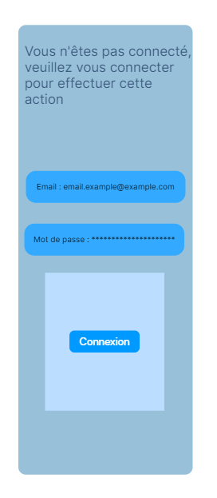
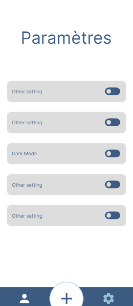
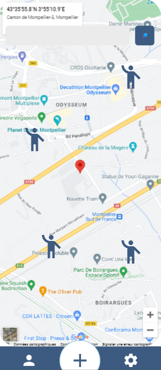
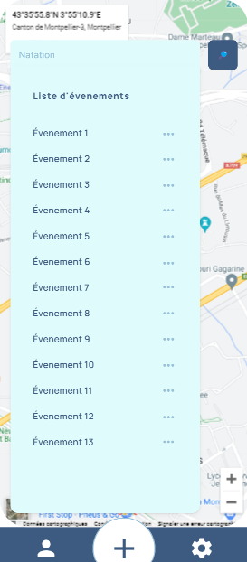
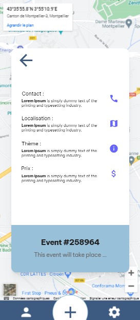

# Activities App

Welcome to the Activity Map App ! This app is designed to help you find and plan activities in your area. Whether you're looking for outdoor adventures, cultural events, or just want to explore what your city has to offer, the Activity Map App has you covered.

With the app, you can view a map of activities in your area and see what's happening near you. You can also view details about each activity, including its location and a description of what it involves. And if you want to add your own activity to the map, you can do that too ! (WIP)

The Activity Map App is built using React Native and the React Native Paper library, which allows to create a material design look and feel in the app. It also uses the React Native Maps library to display the map, and the Expo platform to simplify the development process. The backend part of the project is handled by Supabase, which is an open-source Firebase alternative.

## Getting Started

To get started with this app, follow these steps:

1.  Clone the repository:

git clone https://github.com/0pahh/activities-app.git

2.  Install the dependencies:

cd activity-map-app yarn install

3.  Start the app:

yarn start

This will start the React Native packager and open the app in your default browser.

## Features

- Display a map of activities in a given area
- View details about each activity, including its location and description
- Add new activities to the map (WIP)
- Settings

## Screens

The app has the following screens:

### Login

The login screen allows users to sign in to the app. It includes a form for entering the user's email and password, as well as buttons for logging in and creating a new account.

### Settings

The settings screen allows users to customize their app experience. It includes options for changing the map style, enabling notifications, and more.

### Main

The main screen displays a map of activities in the user's area. It includes a search bar for finding specific activities, as well as markers on the map that represent each activity. When user clicks on a marker, it will display the activity's information as a modal.

### Detailed

The detailed screen displays more information about a specific activity. It includes the activity's location, description, and any other relevant details.

## Dependencies

This app uses the following libraries:

- [React Native](https://facebook.github.io/react-native/)
- [React Native Maps](https://github.com/react-native-community/react-native-maps)
- [React Native Paper](https://reactnativepaper.com/)
- [Expo](https://expo.io/)
- [Supabase](https://supabase.io/)

## Contributing

If you want to contribute to this project, please follow these guidelines:

1.  Fork the repository
2.  Create a new branch for your feature
3.  Commit your changes
4.  Open a pull request

Thank you for considering contributing to this project!

## License

This project is licensed under the MIT License. See the [LICENSE](https://opensource.org/licenses/MIT) file for details.
